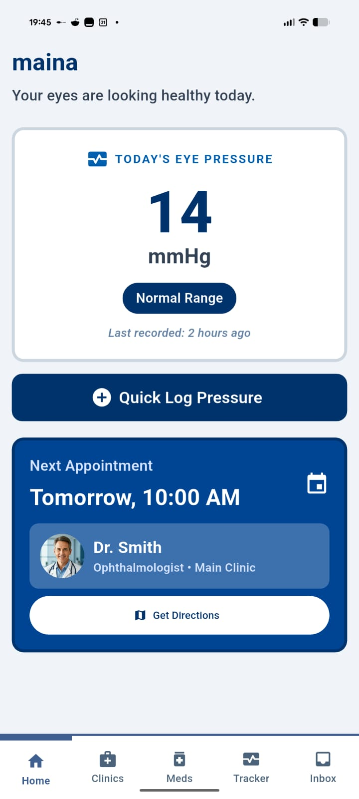
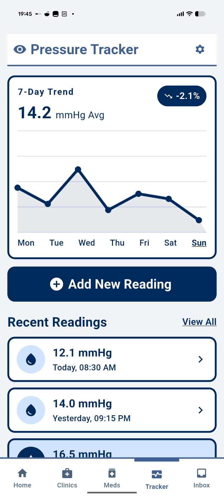
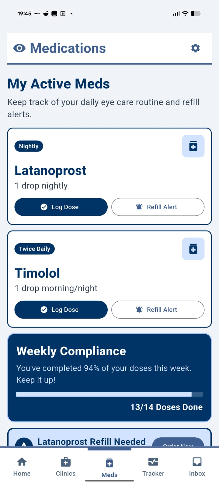
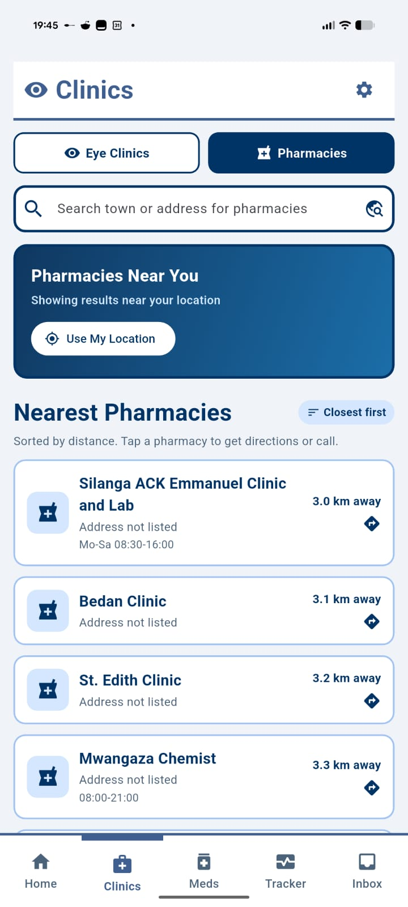

# Resolve

## Inspiration

Resolve was inspired by a challenge close to home. Four members of my family live with glaucoma, a chronic eye condition that requires consistent treatment and regular follow-up care. We have seen firsthand how difficult it can be to manage medication schedules, refill prescriptions, locate eye care providers, and keep track of important health information.

Many of these tasks are still handled manually through phone calls, internet searches, and personal reminders. We wanted to explore how technology could simplify this journey and help patients stay connected to their treatment.

## What it does

Resolve helps people with chronic eye conditions stay on track with their care.

The platform allows patients to:

* Track intraocular pressure (IOP) readings over time
* Log medication doses and treatment adherence
* Search for prescribed eye medications
* Discover nearby eye clinics and care providers
* Keep important eye care information organized in one place

### Eye Pressure Tracking

Patients can record and monitor their eye pressure readings, helping them maintain a history of their condition over time.

### Medication Management

Resolve helps patients keep track of prescribed medications and treatment adherence.

### Find Medication and Clinics

Patients can search for prescribed eye medication and discover nearby eye care providers.

## How we built it

Resolve was developed as a cross-platform mobile application using a modern technology stack:

* **Frontend:** Flutter
* **Backend:** FastAPI (Python)
* **Database:** SQLite
* **Design & Prototyping:** Stitch, Adobe Illustrator
* **Development Tools:** Google Gemini

We used AI-assisted development tools to accelerate implementation, allowing us to move quickly from idea to working prototype within the limited time available during the hackathon.

## Challenges we ran into

Our biggest challenge was debugging and integrating AI-generated code under tight deadlines. While code generation tools helped us build features quickly, they also introduced issues that required careful troubleshooting and manual fixes.

We also faced the challenge of defining a clear value proposition. As we spoke about the project and demonstrated the prototype, we realized the importance of validating assumptions and ensuring that the problem we were solving was genuinely important to patients.

## Accomplishments that we're proud of

* Turning a personal healthcare challenge into a functional prototype
* Building a complete mobile application within a few hours
* Successfully integrating frontend, backend, and database components
* Learning to collaborate effectively under hackathon pressure
* Delivering a working proof of concept that can be tested with real users

## What we learned

This project taught us valuable lessons about:

* Rapid prototyping and AI-assisted development
* Working with FastAPI and Flutter in a full-stack application
* Debugging generated code efficiently
* Presenting ideas and receiving critical feedback
* Teamwork, communication, and time management during a hackathon

Most importantly, we learned that building software is only part of the challenge. Understanding users and validating assumptions is equally important.

## What's next for Resolve

The next step is validation.

We plan to test Resolve with real patients, caregivers, pharmacies, and eye care professionals to better understand their needs and workflows. Their feedback will help us refine our value proposition, identify the most valuable features, and determine where Resolve can create the greatest impact.

Our long-term vision is to make it easier for people with chronic eye conditions to stay connected to treatment and reduce the risk of preventable vision loss.
